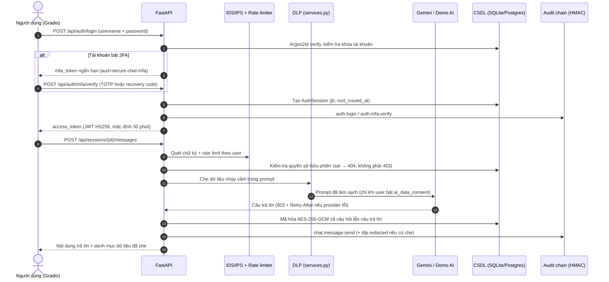

# 🛡️ Secure Conversational Application Platform (SCAP)

> **Đồ án môn học:** Bảo mật Ứng dụng và Hệ thống
> **Kiến trúc:** FastAPI + Gradio 6 (SPA thuần Python) + AES-256-GCM at rest + chuỗi audit HMAC-SHA256 + IDS/IPS tầng ứng dụng

[](https://www.python.org/)
[](https://fastapi.tiangolo.com/)
[](https://gradio.app/)
[]()
[](.github/workflows/security.yml)

---

## 📋 Mục lục

1. [Tổng quan dự án](#1-tổng-quan-dự-án)
2. [Bản đồ mã nguồn](#2-bản-đồ-mã-nguồn)
3. [Kiến trúc & luồng xử lý](#3-kiến-trúc--luồng-xử-lý)
4. [Các lớp bảo vệ (đối chiếu với mã nguồn)](#4-các-lớp-bảo-vệ-đối-chiếu-với-mã-nguồn)
5. [Giao diện Gradio](#5-giao-diện-gradio)
6. [Danh mục REST API](#6-danh-mục-rest-api)
7. [Chạy nhanh trên máy cá nhân](#7-chạy-nhanh-trên-máy-cá-nhân)
8. [Tài khoản demo & dữ liệu mẫu](#8-tài-khoản-demo--dữ-liệu-mẫu)
9. [Chạy bằng Docker](#9-chạy-bằng-docker)
10. [Kiểm thử, CI/CD & đánh giá an ninh](#10-kiểm-thử-cicd--đánh-giá-an-ninh)
11. [Vận hành: xoay khóa, migration, phục hồi audit](#11-vận-hành-xoay-khóa-migration-phục-hồi-audit)
12. [Cấu hình qua biến môi trường](#12-cấu-hình-qua-biến-môi-trường)
13. [Cấu trúc thư mục](#13-cấu-trúc-thư-mục)
14. [Giới hạn có chủ đích](#14-giới-hạn-có-chủ-đích)

---

## 1. Tổng quan dự án

**SCAP** là nền tảng trò chuyện AI đa người dùng, viết để minh họa một chuỗi kiểm soát
an ninh đầy đủ chứ không chỉ một tính năng đơn lẻ: xác thực mạnh (Argon2id + TOTP),
phân quyền RBAC kèm kiểm tra quyền sở hữu, mã hóa nội dung khi lưu trữ (AES-256-GCM
có AAD), DLP trước khi gửi dữ liệu ra nhà cung cấp AI bên ngoài, IDS/IPS tầng ứng dụng,
và nhật ký kiểm toán chống giả mạo bằng chuỗi băm HMAC.

Toàn bộ ứng dụng là **một tiến trình FastAPI duy nhất** ([src/app/main.py](src/app/main.py)).
Giao diện Gradio được `mount` vào chính ứng dụng đó tại `/`, và bản thân UI **gọi ngược lại
REST API qua HTTP** ([src/app/gradio_ui.py](src/app/gradio_ui.py)) — nghĩa là mọi thao tác
trên giao diện đều đi qua đúng lớp JWT, RBAC, rate limit và audit như một client bên ngoài.
Không có đường tắt nào từ UI xuống thẳng cơ sở dữ liệu.

Mặc định hệ thống chạy **SQLite + rate limiter in-memory + AI demo ngoại tuyến**, nên clone
về là chạy được ngay. Cấu hình production (`APP_ENV=production`) bật một loạt guard bắt buộc
và chuyển sang PostgreSQL + Redis + Caddy.

---

## 2. Bản đồ mã nguồn

| File | Trách nhiệm |
| :--- | :--- |
| [src/app/main.py](src/app/main.py) | Tạo app, middleware bảo mật (security headers/CSP/IDS), toàn bộ route REST, mount Gradio |
| [src/app/config.py](src/app/config.py) | `Settings` đọc từ biến môi trường + **guard production** (từ chối khởi động nếu cấu hình yếu) |
| [src/app/security.py](src/app/security.py) | `PasswordService` (Argon2id), `TokenService` (JWT), `CryptoService` (AES-256-GCM + key ring), `TotpService` (TOTP tự cài đặt), `PwnedPasswordChecker`, hai bản rate limiter |
| [src/app/services.py](src/app/services.py) | **DLP redaction**, `AIService` (Gemini/demo), `ChatService` (mã hóa & giải mã hội thoại) |
| [src/app/ids.py](src/app/ids.py) | IDS/IPS: engine `signature` (SQLi/XSS/traversal/scanner UA) + engine `anomaly` (dò trên chính audit log), trạng thái chặn nguồn |
| [src/app/audit.py](src/app/audit.py) | Ghi sự kiện audit, xác định IP nguồn |
| [src/app/audit_chain.py](src/app/audit_chain.py) | Chuỗi băm chống giả mạo: `entry_hash = HMAC-SHA256(key, prev_hash ‖ canonical(entry))` |
| [src/app/siem.py](src/app/siem.py) | Xuất sự kiện an ninh ra stdout dạng JSON một dòng (ECS-like) cho SIEM |
| [src/app/models.py](src/app/models.py) | ORM: `User`, `AuthSession`, `ChatSession`, `SecureMessage`, `AuditEvent`, `RevokedToken`, `MfaRecoveryCode` |
| [src/app/schemas.py](src/app/schemas.py) | Pydantic request/response, ràng buộc đầu vào |
| [src/app/db.py](src/app/db.py) | Engine/session SQLAlchemy, `create_all`, `assert_schema_ready` |
| [src/app/gradio_ui.py](src/app/gradio_ui.py) | Toàn bộ giao diện (theme, CSS, 7 tab) — chỉ nói chuyện với API qua `httpx` |
| [src/app/demo_seed.py](src/app/demo_seed.py) | Sinh tài khoản/hội thoại mẫu (idempotent) |
| [src/core/ai_core/gemini_ai.py](src/core/ai_core/gemini_ai.py) | Wrapper mỏng quanh SDK `google-genai` |

> **Lưu ý khi đọc báo cáo:** DLP nằm ở `services.py`, IDS nằm ở `ids.py` — `security.py`
> chỉ chứa các primitive mật mã/xác thực. Ba thứ này cố ý tách rời nhau.

---

## 3. Kiến trúc & luồng xử lý

```text
┌──────────────────────────────────────────────────────────────────┐
│  Trình duyệt  →  Gradio SPA (mount tại "/", src/app/gradio_ui)   │
│  UI gọi REST API qua httpx: không có lối đi tắt xuống CSDL       │
└─────────────────────────────┬────────────────────────────────────┘
                              │ HTTPS (Caddy, chỉ ở production)
┌─────────────────────────────▼────────────────────────────────────┐
│  MIDDLEWARE — src/app/main.py                                    │
│   • TrustedHost (chống Host header injection / DNS rebinding)    │
│   • CORS (allowlist, allow_credentials=False)                    │
│   • Giới hạn body 1 MiB, chuẩn hóa X-Request-ID                  │
│   • IDS/IPS: quét URL + header, chặn nguồn khi vượt ngưỡng       │
│   • Security headers + CSP theo từng nhóm đường dẫn              │
└─────────────────────────────┬────────────────────────────────────┘
┌─────────────────────────────▼────────────────────────────────────┐
│  XÁC THỰC & PHÂN QUYỀN                                           │
│   • Argon2id (t=3, m=64 MiB, p=4) + hash giả chống enumeration   │
│   • TOTP RFC 6238 hai bước + recovery code dùng một lần          │
│   • JWT HS256 (iss/aud/jti/ver) + AuthSession phía server        │
│   • RBAC user/moderator/admin + kiểm tra quyền sở hữu từng phiên │
└─────────────────────────────┬────────────────────────────────────┘
┌─────────────────────────────▼────────────────────────────────────┐
│  DLP — src/app/services.py                                       │
│   Che mật khẩu, Bearer token, JWT, private key, Google API key,  │
│   số thẻ, email, số điện thoại, số định danh trước khi ra ngoài  │
└─────────────────────────────┬────────────────────────────────────┘
┌─────────────────────────────▼────────────────────────────────────┐
│  LƯU TRỮ & KIỂM TOÁN                                             │
│   • AES-256-GCM, AAD = secure-chat|session_id|role|v{key}        │
│   • Key ring nhiều phiên bản → xoay khóa không downtime          │
│   • audit_events nối chuỗi HMAC-SHA256, verify qua API           │
│   • SIEM: JSON một dòng ra stdout                                │
└──────────────────────────────────────────────────────────────────┘
```

### Luồng một tin nhắn



---

## 4. Các lớp bảo vệ (đối chiếu với mã nguồn)

### 4.1 Xác thực & quản lý phiên
- **Argon2id** `time_cost=3, memory_cost=64 MiB, parallelism=4`; đăng nhập với username không
  tồn tại vẫn verify một hash giả để giảm rò rỉ qua thời gian phản hồi.
- **Khóa tài khoản**: quá `LOGIN_MAX_ATTEMPTS` lần sai → khóa `LOGIN_LOCKOUT_SECONDS`.
- **Rate limit hai chiều**: theo *tài khoản* và theo *IP* — chặn cả brute force lẫn password spraying.
- **TOTP (RFC 6238)** cài đặt trực tiếp bằng thư viện chuẩn để báo cáo giải thích được HOTP/TOTP;
  lưu `mfa_last_counter` để một mã đã dùng không thể replay trong cùng bước thời gian.
- **Recovery code** chỉ lưu hash Argon2id, dùng một lần.
- **JWT HS256** có `iss`/`aud`/`jti`/`ver`; mỗi token gắn một bản ghi `AuthSession` phía server
  nên thu hồi được từng thiết bị (`DELETE /api/auth/sessions/{jti}`) hoặc tất cả (`logout-all`).
- **Trần phiên tuyệt đối**: `root_issued_at` được mang qua mỗi lần `/api/auth/refresh`, vượt
  `SESSION_ABSOLUTE_HOURS` (mặc định 8h) thì buộc đăng nhập lại — sliding session không thành vĩnh viễn.
- **Mật khẩu** tối thiểu 15 ký tự (NIST 800-63B ưu tiên độ dài); tùy chọn đối chiếu HIBP bằng
  k-anonymity, fail-open khi mất mạng.

### 4.2 Mã hóa dữ liệu khi lưu trữ
- Mọi tin nhắn lưu dưới dạng **AES-256-GCM**, nonce 96-bit ngẫu nhiên cho từng bản ghi.
- **AAD** ràng buộc `session_id`, `role`, `key_version`: bê một bản mã sang phiên khác hoặc đổi
  vai trò sẽ hỏng xác thực thay vì giải mã thành công.
- Bí mật TOTP dùng namespace AAD riêng (`secure-chat|field|...`) nên không thể hoán đổi với bản mã tin nhắn.
- **Key ring**: `MASTER_ENCRYPTION_KEYS=1:...,2:...` + `ACTIVE_KEY_VERSION` — khóa cũ vẫn giải mã
  được dữ liệu cũ trong khi dữ liệu mới đã ghi bằng khóa mới.

### 4.3 DLP trước khi ra khỏi biên tin cậy
Áp dụng ở [src/app/services.py](src/app/services.py) cho **cả prompt lẫn phản hồi**, và trả về
*tên danh mục* đã che (không bao giờ trả lại giá trị gốc) để UI và audit log hiển thị an toàn.
Ngoài ra dữ liệu người dùng được bọc trong JSON `UNTRUSTED_USER_DATA_JSON` kèm system instruction
để giảm rủi ro prompt injection. Việc gọi AI ngoài **chỉ xảy ra khi người dùng bật đồng ý**
(`PATCH /api/auth/ai-consent`); chưa đồng ý thì trả 403.

### 4.4 IDS/IPS tầng ứng dụng
- Engine **signature**: 10 nhóm luật (SQLi, XSS, path traversal, command injection, SSTI,
  Log4Shell, NoSQL injection), nhận diện User-Agent công cụ quét và các đường dẫn "mồi".
- Engine **anomaly**: soi chính bảng `audit_events` để phát hiện credential stuffing, brute force
  một tài khoản, và chuỗi từ chối quyền liên tiếp (dấu hiệu dò IDOR).
- Điểm rủi ro tích lũy (high=3 / medium=2 / low=1); vượt `IDS_BLOCK_THRESHOLD` thì **chặn nguồn**
  `IDS_BLOCK_SECONDS` và trả 403 kèm `Retry-After`.
- Middleware cố ý **không đọc body**: buffer body ở middleware sẽ phá streaming và tạo primitive
  khuếch đại bộ nhớ cho kẻ tấn công.

### 4.5 Audit chống giả mạo & SIEM
- `entry_hash = HMAC-SHA256(audit_key, prev_hash ‖ canonical(entry))`, `audit_key` dẫn xuất từ
  `APP_SECRET_KEY` với nhãn riêng (tách khóa khỏi khóa ký JWT) và **không nằm trong CSDL**.
- Sửa/xóa một dòng làm gãy toàn bộ chuỗi phía sau; kiểm chứng bằng `GET /api/admin/audit/verify`
  hoặc nút *Xác minh chuỗi* trên tab Bảo mật.
- Song song, mỗi sự kiện được in ra stdout dạng JSON một dòng cho Loki/ELK/Splunk/Wazuh.

### 4.6 Cứng hóa tầng HTTP
`X-Content-Type-Options`, `X-Frame-Options: DENY`, `Referrer-Policy: no-referrer`,
`Permissions-Policy`, `Cache-Control: no-store`, HSTS ở production, và **CSP tách theo nhóm đường dẫn**:
`/api/*` dùng `default-src 'none'`; `/docs`, `/redoc` nới đúng phần Swagger cần; UI Gradio bỏ
`'unsafe-eval'` theo mặc định (bật lại có chủ đích bằng `CSP_ALLOW_UNSAFE_EVAL`).

---

## 5. Giao diện Gradio

Theme `gr.themes.Soft` — emerald/slate, font `Be Vietnam Pro`, font mono `IBM Plex Mono` cho
dữ liệu mật mã, cột nội dung giới hạn 1400px, có token màu riêng cho dark mode.

| Tab | Nội dung | Quyền |
| :--- | :--- | :--- |
| **Trò chuyện** | Danh sách phiên (tạo/đổi tên/xóa/xuất JSON), khung chat có avatar, cảnh báo DLP | mọi vai trò |
| **Dữ liệu mã hóa** | Soi bản mã AES-256-GCM thật của từng tin nhắn (ciphertext, nonce, key version) | mọi vai trò |
| **Tìm kiếm** | Tìm toàn cục trên các phiên *thuộc sở hữu người gọi* (giải mã phía server) | mọi vai trò |
| **Tài khoản** | Đổi mật khẩu kèm thanh đo độ mạnh, bật/tắt 2FA (QR + recovery code), đồng ý gửi dữ liệu cho AI, quản lý & thu hồi thiết bị | mọi vai trò |
| **Quản trị** | Thống kê hệ thống, tạo/xóa người dùng, đổi vai trò, khóa/mở khóa tài khoản | admin |
| **Nhật ký kiểm toán** | Bảng `audit_events` gần nhất | moderator, admin |
| **Bảo mật** | Phát hiện IDS & bất thường; **admin thêm**: xác minh chuỗi audit, danh sách chặn (gỡ chặn được) | moderator (một phần), admin |

Tab *Bảo mật* nạp bốn khối độc lập, mỗi khối bọc lỗi riêng, nên moderator thiếu quyền ở một khối
vẫn xem được ba khối còn lại thay vì trắng cả màn hình.

Thanh trên cùng hiển thị username, vai trò, `jti` của phiên và **đồng hồ đếm ngược hạn token**.
Trang đăng nhập là luồng hai bước: mật khẩu → mã TOTP (hoặc recovery code).

> Giao diện tránh dùng `gr.HTML` một cách có chủ đích: Gradio 6 biên dịch markup của component
> đó bằng `new Function()`, thứ mà CSP không có `'unsafe-eval'` sẽ chặn.

---

## 6. Danh mục REST API

Tài liệu tương tác: `/docs` và `/redoc` (tự tắt khi `APP_ENV=production`).

### Xác thực
| Method | Đường dẫn | Ghi chú |
| :--- | :--- | :--- |
| `POST` | `/api/auth/register` | Rate limit theo IP; mật khẩu ≥ `PASSWORD_MIN_LENGTH` |
| `POST` | `/api/auth/login` | Trả `access_token`, **hoặc** `mfa_token` nếu tài khoản bật 2FA |
| `POST` | `/api/auth/mfa/verify` | Bước hai: mã TOTP hoặc recovery code |
| `POST` | `/api/auth/mfa/enroll` · `/activate` · `/disable` | Ghi danh (QR + secret), kích hoạt, tắt 2FA |
| `GET` | `/api/auth/me` | Hồ sơ người gọi |
| `PATCH` | `/api/auth/ai-consent` | Bật/tắt đồng ý gửi nội dung cho AI bên ngoài |
| `PATCH` | `/api/auth/password` | Đổi mật khẩu (có rate limit riêng) |
| `POST` | `/api/auth/refresh` | Xoay token, giữ `root_issued_at` để áp trần phiên |
| `POST` | `/api/auth/logout` · `/logout-all` | Thu hồi phiên hiện tại / mọi phiên |
| `GET`/`DELETE` | `/api/auth/sessions[/{jti}]` | Liệt kê và thu hồi từng thiết bị |

### Hội thoại
| Method | Đường dẫn | Ghi chú |
| :--- | :--- | :--- |
| `POST`/`GET` | `/api/sessions` | Tạo / liệt kê phiên của chính mình |
| `GET`/`PATCH`/`DELETE` | `/api/sessions/{id}` | Truy cập sai chủ sở hữu → **404** (giảm enumeration) |
| `GET` | `/api/sessions/{id}/messages` | Nội dung đã giải mã |
| `GET` | `/api/sessions/{id}/ciphertexts` | Bản mã thô + nonce + key version |
| `GET` | `/api/sessions/{id}/export` | Xuất hội thoại ra JSON |
| `POST` | `/api/sessions/{id}/messages` | Gửi tin nhắn; 403 nếu chưa đồng ý AI, 503 + `Retry-After` nếu provider lỗi |
| `GET` | `/api/search/messages` | Tìm kiếm toàn cục trong phạm vi sở hữu |

### Quản trị & giám sát
| Method | Đường dẫn | Quyền |
| :--- | :--- | :--- |
| `GET` | `/api/admin/audit` | moderator, admin |
| `GET` | `/api/admin/ids/detections` · `/ids/anomalies` | moderator, admin |
| `GET`/`POST`/`DELETE` | `/api/admin/users[/{id}]` | admin |
| `PATCH` | `/api/admin/users/{id}/role` · `/status` | admin |
| `GET` | `/api/admin/stats` · `/security-alerts` | admin |
| `GET` | `/api/admin/audit/verify` | admin — xác minh chuỗi HMAC |
| `GET`/`DELETE` | `/api/admin/ids/blocklist[/{ip}]` | admin |
| `GET` | `/api/health` | công khai, cố ý tối giản |

> Admin **không** đọc được nội dung hội thoại của người khác qua API: `ChatService.get_owned_session`
> luôn lọc theo `owner_id`, kể cả với vai trò admin. Đây là lựa chọn thiết kế, không phải thiếu sót.

---

## 7. Chạy nhanh trên máy cá nhân

Yêu cầu: **Python 3.10+** và [`uv`](https://docs.astral.sh/uv/) (uv có thể tự tải Python nếu máy chưa có).

```bash
git clone https://github.com/nguyentuanthien2384/Secure_Conversational_Application_Platform.git
cd Secure_Conversational_Application_Platform

uv sync --group dev          # cài dependency đúng theo uv.lock
cp .env.example .env         # Windows PowerShell: Copy-Item .env.example .env
uv run python scripts/generate_secrets.py   # sinh APP_SECRET_KEY / MASTER_ENCRYPTION_KEY

uv run python scripts/seed_demo_data.py     # dữ liệu mẫu (tùy chọn)
uv run python run_app.py
```

- **Giao diện:** <http://127.0.0.1:8000>
- **OpenAPI / Swagger:** <http://127.0.0.1:8000/docs>

Có sẵn script bọc sẵn cho lần đầu: [setup.sh](setup.sh) (Linux/macOS) và [setup.ps1](setup.ps1) (Windows).
Không cấu hình `GOOGLE_GENAI_API_KEY` thì ứng dụng chạy **Demo AI ngoại tuyến** — vẫn đủ để trình
diễn toàn bộ luồng bảo mật, kể cả DLP.

Tài liệu đi kèm: [HUONG_DAN_CHAY.md](HUONG_DAN_CHAY.md) (từng bước đến lúc demo được),
[HUONG_DAN_DOCKER.md](HUONG_DAN_DOCKER.md), [docs/DEMO_SCRIPT.md](docs/DEMO_SCRIPT.md) (kịch bản bảo vệ đồ án).

---

## 8. Tài khoản demo & dữ liệu mẫu

```bash
uv run python scripts/seed_demo_data.py           # tạo dữ liệu mẫu (idempotent)
uv run python scripts/seed_demo_data.py --reset   # xóa và tạo lại
```

Hoặc đặt `SEED_DEMO_DATA=true` trong `.env` để seed ngay lúc khởi động (guard production sẽ
**từ chối khởi động** nếu cờ này bật ở `APP_ENV=production`).

Mật khẩu chung: **`Phenikaa-Vault#2026-Lab`**

| Tài khoản | Vai trò | Thấy được gì |
| :--- | :--- | :--- |
| `demo.user` | `user` | Trò chuyện, soi bản mã, tìm kiếm, 2FA & thiết bị |
| `demo.mod` | `moderator` | Như trên + Nhật ký kiểm toán, phát hiện IDS & bất thường |
| `demo.boss` | `admin` | Toàn quyền: thống kê, quản lý user, danh sách chặn IDS, xác minh chuỗi audit |

[scripts/seed_learning_data.py](scripts/seed_learning_data.py) sinh khối lượng dữ liệu lớn hơn
để bảng thống kê và biểu đồ có gì để nhìn khi demo.

---

## 9. Chạy bằng Docker

### 9.1 Bản production (cần tên miền thật)

[docker-compose.yml](docker-compose.yml) là cấu hình production đầy đủ — 5 service, phân đoạn
mạng, PostgreSQL ba vai trò quyền tối thiểu, Caddy tự xin chứng chỉ Let's Encrypt:

| Service | Image | Mạng | Vai trò |
| :--- | :--- | :--- | :--- |
| `db` | postgres:17-alpine | `backend` (internal) | scram-sha-256, log connection + DDL |
| `redis` | redis:7.4-alpine | `backend` | rate limiter dùng chung, read-only + tmpfs |
| `migrate` | build `.` | `backend` | chạy một lần: tạo schema rồi hạ quyền |
| `app` | build `.` | `backend` + `edge` | FastAPI + Gradio, chạy bằng role `scap_app` (không có DDL) |
| `caddy` | caddy:2.10-alpine | `edge` | reverse proxy HTTPS, service **duy nhất** publish 80/443 |

```bash
cp .env.example .env
# Bắt buộc: POSTGRES_PASSWORD, APP_DB_PASSWORD, AUDITOR_DB_PASSWORD, PUBLIC_DOMAIN, CADDY_EMAIL
docker compose up --build -d
```

Cứng hóa hạ tầng: mọi container `cap_drop: ALL` + `no-new-privileges`, `read_only` rootfs với
tmpfs cho `/tmp`, `pids_limit`/`mem_limit`/`ulimits` chống cạn kiệt tài nguyên, mạng `backend`
đặt `internal: true` nên Postgres và Redis không có đường ra Internet.

### 9.2 Bản demo trên laptop (không cần tên miền)

[docker-compose.local.yml](docker-compose.local.yml) là lớp phủ tắt Caddy và publish thẳng cổng app:

```bash
docker compose -f docker-compose.yml -f docker-compose.local.yml up -d --build
```

⚠️ Lớp phủ này publish app trực tiếp trong khi container vẫn chạy `--forwarded-allow-ips=*`,
nên client có thể tự chèn `X-Forwarded-For` và làm sai lệch IP nguồn trong rate limit / IDS /
audit log. **Chỉ dùng để demo cục bộ.**

---

## 10. Kiểm thử, CI/CD & đánh giá an ninh

### 10.1 Chạy tại máy

```bash
uv run python -m pytest --cov=src.app --cov-report=term-missing   # 106 test
uv run ruff check src tests scripts
uv run bandit -r src/app -ll -ii
uv run pip-audit
bash scripts/run_zap_baseline.sh http://127.0.0.1:8000            # DAST (cần Docker)
```

Bộ test ([tests/](tests/)) không chỉ kiểm chức năng mà kiểm **chính các kiểm soát an ninh**:

| File | Trọng tâm |
| :--- | :--- |
| [tests/test_api_security.py](tests/test_api_security.py) | RBAC, IDOR, rate limit, thu hồi token |
| [tests/test_security_v2.py](tests/test_security_v2.py) | DLP, security headers, audit chain, IDS |
| [tests/test_crypto.py](tests/test_crypto.py) | AES-GCM, ràng buộc AAD |
| [tests/test_mfa.py](tests/test_mfa.py) | TOTP, chống replay, recovery code |
| [tests/test_hardening.py](tests/test_hardening.py) | Guard production, trần phiên, CSP |
| [tests/test_ai_provider_errors.py](tests/test_ai_provider_errors.py) | Lỗi provider → 503, không rò rỉ chi tiết |
| [tests/test_fixes_2026_07.py](tests/test_fixes_2026_07.py) | Regression cho từng lỗi đã sửa |
| [tests/test_ui_wiring.py](tests/test_ui_wiring.py) | UI gọi đúng API, không đi tắt |

### 10.2 Pipeline GitHub Actions

[.github/workflows/security.yml](.github/workflows/security.yml) chạy 5 job song song trên mỗi
push vào `main` và mỗi pull request:

| Job | Nội dung | Chặn merge khi |
| :--- | :--- | :--- |
| `test` | `uv lock --check` → pytest + coverage → ruff → bandit → `uv export` → pip-audit | test đỏ, lint đỏ, hoặc dependency có CVE |
| `secret-scan` | gitleaks trên **toàn bộ lịch sử** (`fetch-depth: 0`) | có secret bị commit |
| `sast` | Semgrep `config: auto` | phát hiện mẫu mã nguy hiểm |
| `filesystem-scan` | Trivy quét cây mã + sinh SBOM CycloneDX | có CVE HIGH/CRITICAL đã có bản vá |
| `image-scan` | Build Docker image rồi Trivy quét **chính image đó** + SBOM | như trên |

Artifact tải về được: `coverage.xml`, `reports-bandit.json`, `reports-pip-audit.json`,
`sbom-source.cdx.json`, `sbom-image.cdx.json`.

> `pip-audit` chạy trên bản export `--no-dev` của `uv.lock`, nên **sàn phiên bản trong
> `pyproject.toml` là một kiểm soát an ninh**: hạ sàn xuống bản dính CVE sẽ làm đỏ CI.
> Ví dụ `cryptography>=50.0.0` đang giữ ở đó vì PYSEC-2026-3552.

Xem thêm [SECURITY.md](SECURITY.md) (chính sách báo lỗi) và
[SECURITY_REVIEW.md](SECURITY_REVIEW.md) (biên bản tự rà soát).

---

## 11. Vận hành: xoay khóa, migration, phục hồi audit

| Việc cần làm | Lệnh |
| :--- | :--- |
| Sinh secret mới | `uv run python scripts/generate_secrets.py` |
| Tạo/cập nhật schema | `uv run python scripts/migrate_database.py` |
| Xoay khóa mã hóa | `uv run python scripts/rotate_encryption_key.py` (đặt `MASTER_ENCRYPTION_KEYS` + `ACTIVE_KEY_VERSION` trước) |
| Nối lại chuỗi audit sau sự cố | `uv run python scripts/repair_audit_chain.py` — xem [docker-compose.repair.yml](docker-compose.repair.yml) |
| Cấp quyền tối thiểu cho Postgres | [scripts/db_least_privilege.sql](scripts/db_least_privilege.sql), chạy tự động bởi [scripts/init_db_roles.sh](scripts/init_db_roles.sh) |
| Kiểm tra nhanh các bản vá | `bash kiem-tra-ban-va.sh` |

Quy trình xoay khóa được thiết kế để **không downtime**: liệt kê mọi khóa từng dùng trong
`MASTER_ENCRYPTION_KEYS`, trỏ `ACTIVE_KEY_VERSION` vào khóa mới, chạy script re-encrypt, xác minh,
rồi mới gỡ khóa cũ khỏi danh sách.

---

## 12. Cấu hình qua biến môi trường

Toàn bộ biến và giải thích nằm trong [.env.example](.env.example). Những nhóm đáng chú ý:

| Nhóm | Biến tiêu biểu |
| :--- | :--- |
| Bí mật | `APP_SECRET_KEY`, `MASTER_ENCRYPTION_KEY`, `MASTER_ENCRYPTION_KEYS`, `ACTIVE_KEY_VERSION` |
| Hạ tầng | `DATABASE_URL`, `REDIS_URL`, `ALLOWED_ORIGINS`, `ALLOWED_HOSTS`, `PUBLIC_DOMAIN` |
| Phiên & token | `ACCESS_TOKEN_MINUTES`, `SESSION_ABSOLUTE_HOURS`, `REFRESH_WINDOW_SECONDS`, `REFRESH_MAX_ATTEMPTS` |
| Hạn mức tài nguyên | `MAX_SESSIONS_PER_USER` (số hội thoại tối đa mỗi người dùng) |
| Chống lạm dụng | `LOGIN_*`, `REGISTRATION_*`, `MESSAGE_*`, `PASSWORD_CHANGE_*` |
| 2FA | `MFA_ISSUER`, `MFA_CHALLENGE_MINUTES`, `MFA_RECOVERY_CODES`, `MFA_*_ATTEMPTS` |
| IDS/Audit/SIEM | `IDS_ENABLED`, `IDS_BLOCK_THRESHOLD`, `IDS_BLOCK_SECONDS`, `AUDIT_CHAIN_ENABLED`, `SIEM_JSON_LOGS` |
| AI | `GOOGLE_GENAI_API_KEY`, `GEMINI_MODEL`, `ALLOW_DEMO_AI` |

Đặt `APP_ENV=production` sẽ kích hoạt các guard trong [src/app/config.py](src/app/config.py):
ứng dụng **từ chối khởi động** nếu thiếu `APP_SECRET_KEY` đủ mạnh, thiếu khóa mã hóa, thiếu
`REDIS_URL` / `ALLOWED_ORIGINS` / `ALLOWED_HOSTS`, còn bật `DOCS_ENABLED` hay `SEED_DEMO_DATA`,
có đặt `BOOTSTRAP_ADMIN_PASSWORD`, hoặc `DATABASE_URL` dùng tài khoản chủ của Postgres.

---

## 13. Cấu trúc thư mục

```text
Secure_Conversational_Application_Platform/
├── .github/workflows/security.yml   # CI: test + 4 lớp quét an ninh
├── src/
│   ├── app/
│   │   ├── main.py                  # FastAPI app, middleware, toàn bộ route, mount Gradio
│   │   ├── config.py                # Settings + guard production
│   │   ├── security.py              # Argon2id, JWT, AES-256-GCM, TOTP, rate limiter
│   │   ├── services.py              # DLP redaction, AIService, ChatService
│   │   ├── ids.py                   # IDS/IPS: signature + anomaly engine
│   │   ├── audit.py                 # Ghi sự kiện audit
│   │   ├── audit_chain.py           # Chuỗi băm HMAC-SHA256 chống giả mạo
│   │   ├── siem.py                  # Log JSON một dòng cho SIEM
│   │   ├── models.py                # ORM SQLAlchemy
│   │   ├── schemas.py               # Pydantic schema
│   │   ├── db.py                    # Engine/session, kiểm tra schema
│   │   ├── gradio_ui.py             # Giao diện Gradio 6 (theme, CSS, 7 tab)
│   │   ├── demo_seed.py             # Dữ liệu mẫu idempotent
│   │   └── ui_assets/               # Ảnh tĩnh của giao diện
│   ├── core/ai_core/gemini_ai.py    # Wrapper SDK google-genai
│   └── utils/helpers.py
├── tests/                           # 106 test, tập trung vào kiểm soát an ninh
├── scripts/                         # secret, migration, rotate key, seed, repair, ZAP
├── docs/DEMO_SCRIPT.md              # Kịch bản demo trước hội đồng
├── reports/                         # Kết quả kiểm thử lưu lại
├── Dockerfile                       # Base image pin được bằng digest, chạy user không phải root
├── docker-compose.yml               # Production: db + redis + migrate + app + caddy
├── docker-compose.local.yml         # Lớp phủ demo trên laptop (tắt Caddy)
├── docker-compose.repair.yml        # Cụm phục hồi chuỗi audit
├── Caddyfile                        # TLS, security header biên, /.well-known/security.txt
├── HUONG_DAN_CHAY.md                # Hướng dẫn chạy chi tiết
├── HUONG_DAN_DOCKER.md              # Hướng dẫn Docker từng bước
├── SECURITY.md / SECURITY_REVIEW.md # Chính sách & biên bản tự rà soát
├── pyproject.toml / uv.lock         # Dependency khóa phiên bản (tái lập được)
└── Makefile                         # install / run / test / security / docker
```

---

## 14. Giới hạn có chủ đích

1. **Khóa nằm cùng tiến trình.** `MASTER_ENCRYPTION_KEY` và khóa HMAC audit đọc từ biến môi
   trường, nên kẻ chiếm được host vẫn giả mạo được chuỗi audit. Hệ thống thật cần KMS/HSM và
   đẩy log sang WORM storage hoặc SIEM từ xa — `siem.py` là bước chuẩn bị cho hướng đó.
2. **CSP còn `'unsafe-inline'`.** Gradio sinh style/script inline. `'unsafe-eval'` đã bỏ được
   (giai đoạn 1); chuyển sang nonce/hash cần tách frontend riêng (giai đoạn 2).
3. **IDS chữ ký là phòng thủ chiều sâu, không phải kiểm soát chính.** SQL injection đã bất khả thi
   về mặt cấu trúc nhờ tham số hóa của SQLAlchemy; engine signature tồn tại để *phát hiện và ghi lại*
   ý đồ tấn công, và có thể bị né bằng mã hóa/obfuscation.
4. **Rate limiter in-memory chỉ đúng cho một tiến trình.** Nhiều worker bắt buộc dùng Redis —
   guard production đã ép điều này.
5. **Chuỗi audit nối tiếp bằng mutex + row lock**, đúng cho một instance; Postgres nhiều writer nên
   dùng advisory lock như ghi chú trong [src/app/audit_chain.py](src/app/audit_chain.py).
6. **Chưa kèm file LICENSE.** Đây là đồ án môn học; hãy thêm `LICENSE` trước khi công bố lại
   dưới một giấy phép cụ thể.
