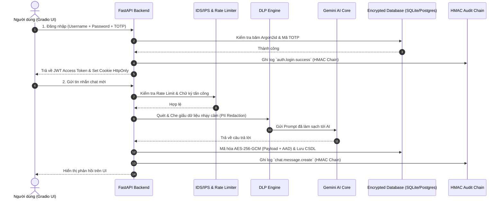

# 🛡️ Secure Conversational Application Platform (SCAP)

> **Đồ án môn học:** Bảo mật Ứng dụng và Hệ thống  
> **Kiến trúc:** Zero-Trust Enterprise AI Assistant Platform (FastAPI + Gradio v5 Pure Python SPA + AES-256-GCM Encrypted Storage + HMAC Audit Chain)

[](https://www.python.org/)
[](https://fastapi.tiangolo.com/)
[](https://gradio.app/)
[]()
[]()

---

## 📋 Mục lục

1. [Tổng quan dự án](#1-tổng-quan-dự-án)
2. [Thiết kế Giao diện UI/UX & Trải nghiệm Người dùng](#2-thiết-kế-giao-diện-uiux--trải-nghiệm-người-dùng)
3. [Tài khoản Demo & Dữ liệu mẫu](#3-tài-khoản-demo--dữ-liệu-mẫu)
4. [Kiến trúc Bảo mật & Các tính năng cốt lõi](#4-kiến-trúc-bảo-mật--các-tính-năng-cốt-lõi)
5. [Sơ đồ Kiến trúc & Luồng xử lý Dữ liệu](#5-sơ-đồ-kiến-trúc--luồng-xử-lý-dữ-liệu)
6. [Hướng dẫn Chạy Ứng dụng Chấn nhanh (Quickstart)](#6-hướng-dẫn-chạy-ứng-dụng-chấn-nhanh-quickstart)
7. [Chạy Production với Docker & PostgreSQL](#7-chạy-production-với-docker--postgresql)
8. [Kiểm thử & Đánh giá An ninh (Testing & Security Audit)](#8-kiểm-thử--đánh-giá-an-ninh-testing--security-audit)
9. [Cấu trúc Thư mục Dự án](#9-cấu-trúc-thư-mục-dự-án)
10. [Giới hạn có chủ đích & Hướng phát triển](#10-giới-hạn-có-chủ-đích--hướng-phát-triển)

---

## 1. Tổng quan dự án

**SCAP (Secure Conversational Application Platform)** là nền tảng trò chuyện AI đa người dùng (Multi-tenant AI Chat Platform) được thiết kế theo mô hình **Zero-Trust**. Hệ thống bảo vệ dữ liệu nhạy cảm của người dùng từ mức truyền tải (TLS), bộ nhớ tạm (DLP Redaction), cơ sở dữ liệu (Mã hóa AES-256-GCM với AAD) cho tới khả năng chống giả mạo nhật ký hệ thống (HMAC SHA-256 Audit Chain).

Giao diện người dùng được xây dựng 100% bằng **Gradio v5 (Python SPA)** kết hợp tùy biến CSS/Theme chuyên sâu, tương tác trực tiếp với hệ thống **FastAPI REST API** phía sau qua HTTP client (`httpx`), đảm bảo 100% thao tác trên UI đều tuân thủ cơ chế xác thực JWT, RBAC, Rate Limiting và Audit Trail.

---

## 2. Thiết kế Giao diện UI/UX & Trải nghiệm Người dùng

Giao diện SCAP được thiết kế theo phong cách **Bảng điều khiển Vận hành An ninh (Security Operations Dashboard)** với độ mật thông tin cao, trải nghiệm mượt mà và trực quan.

### 🎨 Hệ thống Thiết kế (Design System & Aesthetics)
- **Bảng màu chủ đạo (Theme Palette):** Sử dụng tông màu **Emerald (Xanh lục bảo) / Slate (Xám đá)** làm chủ đạo – tượng trưng cho sự tin cậy, mã hóa và an toàn thông tin.
- **Typography:**
  - Font văn bản chính: `Be Vietnam Pro` (Google Fonts) – hiển thị mượt mà, tối ưu tiếng Việt.
  - Font mã hóa & dữ liệu kỹ thuật: `IBM Plex Mono` – dành cho bản mã AES-256, chuỗi băm HMAC, token JTI, chìa khóa mã hóa.
- **Chế độ Tối/Sáng (Dark/Light Mode):** Tự động thích ứng biến màu HSL/RGB, đảm bảo tương phản cao, không gây mỏi mắt khi vận hành giám sát SOC.
- **Bố cục (Layout Density):** Giới hạn container 1200px tối ưu hiển thị trên màn hình máy tính, loại bỏ khoảng trắng thừa, tăng mật độ dữ liệu chuyên nghiệp.

---

### 🖥️ Chi tiết các Phân hệ Giao diện (UI Modules)

#### 1. Thanh Trạng thái & Đồng hồ Token (Live Session Banner)
- **Token Expiry Countdown:** Đồng hồ đếm ngược thời gian sống của JWT Access Token cập nhật thời gian thực mỗi 10 giây.
- **Badge Trạng thái:** Hiển thị Username, Vai trò (`admin`, `moderator`, `user`), và Mã định danh phiên (`Session JTI`).

#### 2. Phân hệ Xác thực & 2FA (Authentication & Security Challenge)
- Form đăng nhập thiết kế nhỏ gọn (420px), trải nghiệm 2 bước mượt mà.
- Hỗ trợ **Mã xác thực hai lớp TOTP 2FA (RFC 6238)** kèm mã QR trực quan cho Google Authenticator / Authy.
- Cơ chế nhập **Mã khôi phục dùng 1 lần (Recovery Codes)** khẩn cấp khi mất thiết bị 2FA.

#### 3. Không gian Trò chuyện AI Secure (Encrypted Chat Workspace)
- **Danh sách Hội thoại (Left Sidebar):** Tạo mới, đổi tên, xóa, xuất dữ liệu hội thoại ra file JSON.
- **Cửa sổ Trò chuyện (Main Chat Window):** Phân biệt Avatar Người dùng / Trợ lý AI, hiển thị tin nhắn thời gian thực.
- **Bộ soi Bản mã (Ciphertext Inspector):** Công cụ đặc trưng cho phép người dùng bấm "Soi bản mã" để kiểm tra dữ liệu đã được mã hóa **AES-256-GCM** kèm IV và Auth Tag trực tiếp dưới CSDL trước khi giải mã.
- **Tìm kiếm Toàn cục (`Global Message Search`):** Tìm kiếm tin nhắn tức thì trên tất cả hội thoại thuộc sở hữu của người dùng.

#### 4. Trung tâm Quản lý Tài khoản & Thiết bị (Account & Device Security Center)
- **Đổi Mật khẩu:** Kiểm tra độ mạnh mật khẩu (tối thiểu 15 ký tự, chống mật khẩu yếu).
- **Quản lý Thiết bị Đăng nhập (Active Session Manager):** Danh sách các thiết bị đang đăng nhập (IP, User-Agent, Thời gian khởi tạo).
- **Đăng xuất Từ xa (Remote Revocation):** Thu hồi từng phiên thiết bị nghi ngờ hoặc **Đăng xuất tất cả thiết bị (Logout All Sessions)** chỉ bằng một cú nhấp chuột.

#### 5. Bảng điều khiển Quản trị & An ninh SOC (Admin & Audit Operations Center)
- **Thống kê Tổng quan System Stats:** Tổng số người dùng, số hội thoại, tổng tin nhắn mã hóa, số sự kiện bị cảnh báo.
- **Nhật ký Kiểm toán Tamper-Proof Audit Logs:** Bảng theo dõi lịch sử truy cập, từ chối quyền, đăng nhập thất bại.
- **Nút Xác minh Chuỗi Audit Logs (`Verify Audit Chain`):** Chạy kiểm tra tính toàn vẹn của chuỗi băm HMAC SHA-256 trên CSDL. Nếu log bị sửa đổi trái phép, hệ thống sẽ phát hiện ngay vị trí bị can thiệp.
- **Cảnh báo IDS/IPS & Quản lý User:** Xem các IP bị khóa tự động, khóa/mở khóa tài khoản khẩn cấp, nâng/hạ quyền người dùng.

---

## 3. Tài khoản Demo & Dữ liệu mẫu

Hệ thống đi kèm script khởi tạo nhanh 3 tài khoản tương ứng với 3 vai trò RBAC và 4 hội thoại mẫu mã hóa sẵn để phục vụ trải nghiệm & chấm đồ án:

```bash
uv run python scripts/seed_demo_data.py           # Tạo dữ liệu mẫu
uv run python scripts/seed_demo_data.py --reset   # Xóa cũ và tạo lại
```

Mật khẩu chung cho tất cả tài khoản demo: **`Phenikaa-Vault#2026-Lab`**

| Tài khoản | Vai trò (RBAC) | Quyền hạn & Phân hệ UI xem được |
| :--- | :--- | :--- |
| **`demo.user`** | `user` | Trò chuyện AI, soi bản mã AES, tìm kiếm tin nhắn, quản lý 2FA & thiết bị |
| **`demo.mod`** | `moderator` | Toàn bộ quyền `user` + Xem Nhật ký Kiểm toán Audit Logs |
| **`demo.boss`** | `admin` | Full quyền Quản trị: Thống kê SOC, Cảnh báo IDS/IPS, Kiểm tra HMAC Audit Chain, Quản lý User |

---

## 4. Kiến trúc Bảo mật & Các tính năng cốt lõi

```text
       ┌────────────────────────────────────────────────────────┐
       │                 CLIENT / GRADIO SPA UI                 │
       └───────────────────────────┬────────────────────────────┘
                                   │ HTTPS / REST API
       ┌───────────────────────────▼────────────────────────────┐
       │              CADDY REVERSE PROXY (TLS 1.3)             │
       └───────────────────────────┬────────────────────────────┘
                                   │
       ┌───────────────────────────▼────────────────────────────┐
       │    FASTAPI MIDDLEWARE LAYER (WAF / IDS / IPS / CORS)   │
       │    - App-level IDS: Brute-force & Spray Detection      │
       │    - Rate Limiter: In-Memory / Redis                   │
       │    - Security Headers (CSP, HSTS, X-Frame-Options)    │
       └───────────────────────────┬────────────────────────────┘
                                   │
       ┌───────────────────────────▼────────────────────────────┘
       │           AUTHENTICATION & ACCESS CONTROL             │
       │    - Argon2id Password Hashing                         │
       │    - TOTP 2FA (RFC 6238) & Recovery Codes              │
       │    - JWT Token Rotation & Server-side Revocation       │
       │    - RBAC (User / Moderator / Admin) & Ownership Check │
       └───────────────────────────┬────────────────────────────┘
                                   │
       ┌───────────────────────────▼────────────────────────────┐
       │             DLP ENGINE (Data Loss Prevention)          │
       │    - Masking PII / Sensitive Data before AI Prompt     │
       └───────────────────────────┬────────────────────────────┘
                                   │
       ┌───────────────────────────▼────────────────────────────┐
       │               ENCRYPTED STORAGE & AUDIT                │
       │    - Data Encryption: AES-256-GCM with AAD             │
       │    - Audit Logging: HMAC SHA-256 Hash-Chained Logs     │
       │    - SIEM Export: ECS Format (JSON Stdout)             │
       └────────────────────────────────────────────────────────┘
```

### Các lớp bảo vệ chính:
1. **Xác thực & Quản lý Phiên (Authentication & Session Management):**
   - Mật khẩu băm bằng thuật toán chịu tải chống phần cứng chuyên dụng **Argon2id**.
   - JWT Access Token ngắn hạn (30 phút) kết hợp Refresh Token có gia hạn trượt và trần tuyệt đối 8 giờ (`SESSION_ABSOLUTE_HOURS`).
   - Quản lý phiên thiết bị (`AuthSession`) hỗ trợ thu hồi token từ xa phía server (`RevokedToken`).
2. **Mã hóa Dữ liệu khi lưu trữ (Encrypted Storage):**
   - Mã hóa toàn bộ nội dung tin nhắn bằng **AES-256-GCM**.
   - Gắn kết dữ liệu bổ sung AAD (`session_id`, `user_role`, `key_version`) chống tráo đổi bản mã giữa các phiên chat khác nhau.
   - Hỗ trợ xoay vòng khóa mã hóa (Key Ring / Rotation).
3. **Phòng chống Lộ Dữ liệu AI (DLP Engine):**
   - Tự động nhận diện và ẩn danh hóa (Masking) dữ liệu nhạy cảm (Email, Số thẻ credit, CCCD, API Key) trước khi chuyển sang cho Gemini AI Core.
4. **Nhật ký Kiểm toán chống Giả mạo (Tamper-Proof Audit Chain):**
   - Mọi sự kiện quan trọng (đăng nhập, đổi quyền, gửi tin, IDOR breach attempt) đều được ghi vào chuỗi băm **HMAC-SHA256**.
   - Bất kỳ hành vi sửa đổi trực tiếp vào bảng Audit Log dưới CSDL sẽ làm gãy chuỗi băm và bị hệ thống phát hiện lập tức khi chạy `/api/admin/audit/verify`.
5. **IDS/IPS & SIEM:**
   - Động cơ phát hiện bất thường tự động chặn IP tấn công Brute-force hoặc Password Spraying.
   - Xuất log theo chuẩn **Elastic Common Schema (ECS)** dạng JSON 1 dòng phục vụ tích hợp SIEM (Splunk, ELK).

---

## 5. Sơ đồ Kiến trúc & Luồng xử lý Dữ liệu



---

## 6. Hướng dẫn Chạy Ứng dụng Chạy nhanh (Quickstart)

### Yêu cầu hệ thống:
- **Python 3.10+**
- Trình quản lý gói **`uv`** (khuyên dùng) hoặc `pip`

### Bước 1: Clone dự án & Cài đặt môi trường
```bash
git clone https://github.com/nguyentuanthien2384/Secure_Conversational_Application_Platform.git
cd Secure_Conversational_Application_Platform

# Cài đặt môi trường với uv
uv sync --group dev
```

### Bước 2: Cấu hình File Môi trường
```bash
cp .env.example .env
```
Tạo bí mật mã hóa riêng và cập nhật vào `.env`:
```bash
uv run python scripts/generate_secrets.py
```

### Bước 3: Nạp dữ liệu mẫu & Khởi động App
```bash
# Nạp dữ liệu demo
uv run python scripts/seed_demo_data.py

# Khởi động ứng dụng SCAP
uv run python run_app.py
```

### Bước 4: Truy cập Giao diện
- **🖥️ Web Demo UI (Gradio SPA):** [http://127.0.0.1:8000](http://127.0.0.1:8000)
- **📖 OpenAPI / Swagger Docs:** [http://127.0.0.1:8000/docs](http://127.0.0.1:8000/docs)

*(Lưu ý: Nếu không cấu hình `GOOGLE_GENAI_API_KEY`, ứng dụng sẽ tự động chạy chế độ **Offline Demo AI** đáp ứng đầy đủ kịch bản thử nghiệm).*

---

## 7. Chạy Production với Docker & PostgreSQL

Dự án hỗ trợ chạy sản phẩm đóng gói hoàn chỉnh bằng **Docker Compose** bao gồm FastAPI, PostgreSQL 16 (Hardened), Caddy Reverse Proxy (Tự động cấp TLS/HTTPS):

```bash
cp .env.example .env
# Chỉnh sửa .env: Đặt các biến POSTGRES_PASSWORD, APP_DB_PASSWORD, AUDITOR_DB_PASSWORD, PUBLIC_DOMAIN

# Khởi động cụm Docker Container
docker compose up --build -d
```

### Đặc điểm bảo mật Hạ tầng Docker:
- Chỉ duy nhất cổng **80/443** của Caddy được mở ra ngoài.
- PostgreSQL, Redis và App Backend nằm trong mạng nội bộ Docker cô lập (`internal_network`).
- Container chạy ở chế độ **Read-Only Root Filesystem** và không có quyền `root`.

---

## 8. Kiểm thử & Đánh giá An ninh (Testing & Security Audit)

Dự án tích hợp bộ công cụ kiểm thử tự động toàn diện:

### 1. Chạy Unit Test & Test Bảo mật Regression
```bash
uv run python -m pytest --cov=src.app --cov-report=term-missing
```

### 2. Kiểm tra Style & Mã nguồn tĩnh (Linting & Static Analysis)
```bash
# Kiểm tra code style bằng Ruff
uv run ruff check src/app tests scripts/

# Phân tích an ninh mã nguồn tĩnh với Bandit
uv run bandit -q -r src/app -ll -ii
```

### 3. Audit Thư viện Phụ thuộc (SCA Dependency Audit)
```bash
uv run pip-audit
```

### 4. Kiểm tra Tự động DAST bằng OWASP ZAP Baseline Scan
```bash
bash scripts/run_zap_baseline.sh http://127.0.0.1:8000
```

---

## 9. Cấu trúc Thư mục Dự án

```text
Secure_Conversational_Application_Platform/
├── src/
│   └── app/                     # Mã nguồn chính ứng dụng FastAPI
│       ├── audit_chain.py       # Động cơ chuỗi băm HMAC Audit Chain
│       ├── config.py            # Cấu hình hệ thống & nạp biến môi trường
│       ├── db.py                # Quản lý kết nối CSDL (SQLite/PostgreSQL)
│       ├── demo_seed.py         # Khởi tạo dữ liệu thử nghiệm
│       ├── gradio_ui.py         # Giao diện Gradio v5 (Pure Python UI/UX)
│       ├── main.py              # FastAPI Application Entrypoint & Routes
│       ├── models.py            # Schema SQLAlchemy & Pydantic
│       └── security.py          # Động cơ Mã hóa AES, JWT, Argon2id, DLP & IDS
├── tests/                       # Bộ kiểm thử an ninh & regression tests
├── scripts/                     # Tool hỗ trợ: tạo secret, rotate key, repair audit
├── docker-compose.yml           # Khởi chạy Docker Production
├── docker-compose.repair.yml    # Khởi chạy cụm phục hồi dữ liệu Audit
├── Makefile                     # Shortcut các câu lệnh phát triển
├── pyproject.toml               # Khai báo dependency & cấu hình dự án
└── README.md                    # Tài liệu hướng dẫn dự án
```

---

## 10. Giới hạn có chủ đích & Hướng phát triển

1. **Rate Limiting in Development:** Mặc định ở môi trường Dev sử dụng In-Memory rate limiter. Môi trường Production bắt buộc kết nối Redis để đồng bộ rate limit giữa nhiều worker nodes.
2. **Key Management:** Khóa mã hóa `MASTER_ENCRYPTION_KEY` hiện đọc từ biến môi trường. Đối với các hệ thống Ngân hàng / Tài chính thật, cần kết nối tới dịch vụ quản lý khóa phần cứng chuyên dụng (AWS KMS / HashiCorp Vault).
3. **CSP Restrictions in Gradio:** Giao diện Gradio hiện tại yêu cầu `'unsafe-inline'` cho các script tương tác UI. Trong tương lai có thể tách riêng Frontend React/Next.js với nonce-based CSP strict để tăng cường độ bảo mật client-side.

---

### 🛡️ License & Contributors
- **Đồ án môn học:** Bảo mật Ứng dụng & Hệ thống (Secure Conversational Application Platform - SCAP).
- Phát hành dưới mã nguồn mở theo giấy phép [MIT License](LICENSE).
