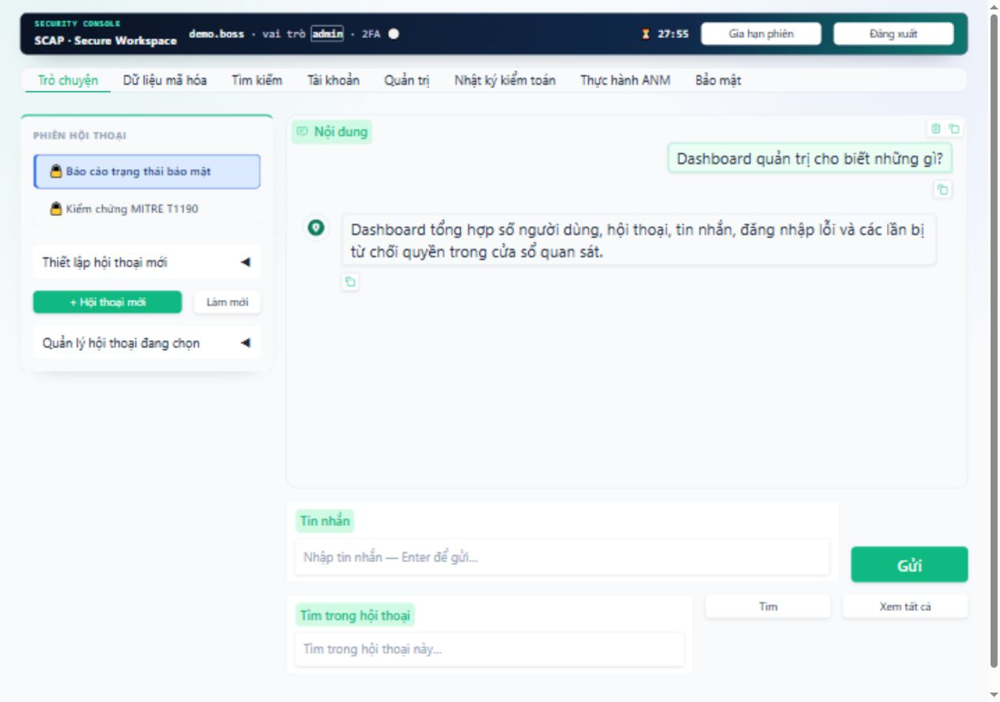
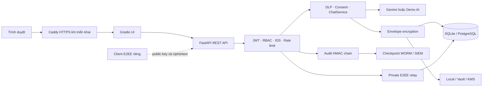

<div align="center">

# 🛡️ SCAP

### Secure Conversational Application Platform

**Nền tảng trò chuyện AI đa người dùng · Bảo mật ứng dụng và hệ thống**

Từ đăng nhập, phân quyền và kiểm soát dữ liệu đến mã hóa, giám sát và xử lý sự cố.

[](pyproject.toml)
[](src/app/main.py)
[](src/app/gradio_ui.py)
[](uv.lock)
[](.github/workflows/security.yml)

[Chạy demo](#chay-demo) · [Giao diện](#giao-dien) · [Triển khai](#trien-khai) · [Tài liệu](#tai-lieu)

</div>

> **Bắt đầu nhanh:** `uv sync --frozen --group dev` → `uv run --frozen python -m scripts.demo_local` → mở [http://127.0.0.1:8000](http://127.0.0.1:8000).
> Launcher tạo dữ liệu/khóa tạm, nạp tài khoản mẫu và dùng AI ngoại tuyến. Sau khi cài thư viện, không cần Docker, API key hoặc sửa `.env` để demo.

## Mục lục

- [Tổng quan và tính năng](#tong-quan)
- [Chạy từ bản clone trên GitHub](#chay-demo)
- [Tài khoản và kịch bản demo](#tai-khoan-demo)
- [Giao diện và trải nghiệm sử dụng](#giao-dien)
- [Vai trò và chế độ bảo mật](#vai-tro)
- [Kiến trúc và các lớp bảo vệ](#kien-truc)
- [Chạy local có lưu dữ liệu](#local)
- [Docker, VPS và high-security](#trien-khai)
- [REST API](#api)
- [Kiểm thử và CI](#kiem-thu)
- [Cấu hình và vận hành](#van-hanh)
- [Cấu trúc mã nguồn và quy tắc Git](#ma-nguon)
- [Xử lý lỗi thường gặp](#xu-ly-loi)
- [Giới hạn và tài liệu tham khảo](#tai-lieu)

<a id="tong-quan"></a>
## Tổng quan và tính năng

**SCAP** là đồ án môn **Bảo mật Ứng dụng và Hệ thống**, xây dựng bằng FastAPI, Gradio 6 và SQLAlchemy. Ứng dụng minh họa các kiểm soát an ninh trong cùng một luồng sử dụng: đăng nhập → tạo hội thoại → kiểm tra dữ liệu → gọi AI → mã hóa lưu trữ → ghi nhật ký kiểm toán.

- **Trò chuyện:** nhiều hội thoại, đổi tên/xóa, tìm kiếm theo quyền sở hữu, xuất JSON và xem bản mã của từng tin nhắn.
- **Bảo vệ tài khoản:** Argon2id, JWT có phiên phía máy chủ, TOTP/recovery code, passkey WebAuthn, email khôi phục, smart lockout và quản lý thiết bị.
- **Bảo vệ dữ liệu:** AES-256-GCM, DEK riêng từng hội thoại, AAD ràng buộc từng tin nhắn, adapter Local/Vault Transit/AWS KMS/GCP KMS.
- **Kiểm soát AI:** Gemini hoặc AI demo, đồng thuận gửi dữ liệu ra bên ngoài, DLP với chính sách cho phép/che/xác nhận/chặn/chỉ xử lý local.
- **Giám sát:** IDS/IPS chữ ký và tương quan bất thường, audit HMAC chain, checkpoint ngoài hệ thống, sự kiện JSON cho SIEM, dashboard ngân sách tài nguyên.
- **Học và thực hành:** 11 bài ANM, báo cáo kiểm chứng và PCAP tổng hợp, hồ sơ sự cố gắn với audit thực cùng lịch sử xử lý.
- **Triển khai:** demo tạm trên laptop, local có dữ liệu lâu dài, Docker với PostgreSQL/Redis/Caddy, hồ sơ VPS nhỏ và high-security.

Repository có **server relay ciphertext cho Private E2EE**. Client Double Ratchet/MLS hoàn chỉnh và kiểm toán độc lập còn là yêu cầu riêng; xem [giới hạn](#gioi-han) trước khi dùng cho dữ liệu nhạy cảm.

<a id="chay-demo"></a>
## Chạy từ bản clone trên GitHub

### 1. Chuẩn bị

Cần **Git**, **Python 3.10+** và **uv**. Python **3.12** được dùng trong CI và Docker. Lần cài thư viện đầu tiên cần Internet; xem [hướng dẫn cài uv chính thức](https://docs.astral.sh/uv/getting-started/installation/) nếu máy chưa có `uv`.

```powershell
git clone https://github.com/nguyentuanthien2384/Secure_Conversational_Application_Platform.git
cd Secure_Conversational_Application_Platform
uv sync --frozen --group dev
```

`uv.lock` được giữ trong Git để cài đúng bộ dependency đã khóa. `.venv` được tạo lại tại máy của bạn, không tải kèm mã nguồn.

### 2. Kiểm tra và mở demo

Các lệnh dưới đây dùng được trên Windows, Linux và macOS:

```powershell
uv run --frozen python -m scripts.demo_local --check
uv run --frozen python -m scripts.demo_local
```

- **Giao diện:** [http://127.0.0.1:8000](http://127.0.0.1:8000).
- **Swagger API:** [http://127.0.0.1:8000/docs](http://127.0.0.1:8000/docs).
- **Passkey:** mở [http://localhost:8000](http://localhost:8000), vì trình duyệt cần tên miền cho WebAuthn.
- **Dừng:** `Ctrl+C`. Khởi động lại tạo lượt demo mới với SQLite và khóa tạm riêng.

`--check` kiểm tra UI, API và các chức năng demo rồi thoát; không mở cổng. Nếu cổng 8000 bận:

```powershell
uv run --frozen python -m scripts.demo_local --port 8080
```

Launcher bỏ qua `.env`, chỉ lắng nghe loopback và ép AI ngoại tuyến. Nó không sửa database local đang có. Mã xác minh email/đặt lại mật khẩu demo nằm trong file `.eml` tại thư mục outbox được in ra lúc khởi động.

Hướng dẫn từng bước: [HUONG_DAN_CHAY.md](HUONG_DAN_CHAY.md). Kịch bản trình bày 6/12 phút: [DEMO_SCRIPT.md](docs/DEMO_SCRIPT.md).

<a id="tai-khoan-demo"></a>
## Tài khoản và kịch bản demo

**Mật khẩu mẫu dùng chung:** `Phenikaa-Vault#2026-Lab`.

- **`demo.user` — user:** trò chuyện, bản mã, tìm kiếm và quản lý bảo mật tài khoản.
- **`demo.mod` — moderator:** thêm nhật ký kiểm toán, thực hành ANM và giám sát IDS/bất thường.
- **`demo.boss` — admin:** thêm dashboard, quản lý tài khoản, xác minh audit và danh sách chặn.

Launcher còn nạp 8 tài khoản `lab.*` và hội thoại mẫu. Tài khoản/mật khẩu này là dữ liệu công khai dành cho học tập; production từ chối `SEED_DEMO_DATA=true`.

**Luồng trải nghiệm đề xuất:**

1. Đăng nhập `demo.user`, chọn hội thoại có sẵn hoặc bấm **Hội thoại mới**. Mở **Thiết lập hội thoại mới** nếu muốn đặt tiêu đề/chế độ/phân loại.
2. Gửi một câu hỏi; phản hồi có nhãn **DEMO AI** khi không dùng provider thật.
3. Thử email mẫu để quan sát DLP, rồi mở **Dữ liệu mã hóa** để xem ciphertext/nonce/key version.
4. Vào **Tài khoản** để xem thiết bị, hoạt động bảo mật, thiết lập TOTP hoặc passkey.
5. Đăng nhập `demo.mod`/`demo.boss` để xem audit, cảnh báo, hồ sơ sự cố và các bài ANM.

Sự kiện seed là **mô phỏng**, không phải bằng chứng có tấn công thật. AI demo minh họa nội dung sau DLP; kiểm chứng nhánh provider thật, consent và lọc phản hồi dùng runner/test riêng:

```powershell
uv run --frozen python -m scripts.validate_security
uv run --frozen python -m scripts.practice_lab --output-dir reports/practice-lab
```

Các kết quả sinh ra trong `reports/` được bỏ qua khi commit. Đọc [SECURITY_AUTOMATION.md](docs/SECURITY_AUTOMATION.md) và [PRACTICAL_ANM.md](docs/PRACTICAL_ANM.md) để hiểu phạm vi kiểm chứng.

<a id="giao-dien"></a>
## Giao diện và trải nghiệm sử dụng

Giao diện tiếng Việt sử dụng theme `Soft`, tông emerald/slate, font hệ thống `system-ui` và `ui-monospace`/`SFMono-Regular`/`Consolas` cho dữ liệu kỹ thuật, cùng màu riêng cho dark mode. Font local phù hợp CSP mà không cần tải font ngoài. Nội dung được nhóm thành thẻ, thao tác chính có màu nổi bật và các thao tác nhạy cảm có bước xác thực lại khi cần.



### Đăng nhập và tài khoản

Trang xác thực có ba luồng **Đăng nhập**, **Tạo tài khoản**, **Quên mật khẩu**; hỗ trợ hiện/ẩn mật khẩu và passkey. Luồng đăng ký có thanh đo độ mạnh mật khẩu. Khi bật 2FA, đăng nhập tiếp tục với TOTP hoặc recovery code. Thanh trên cùng hiển thị tài khoản/vai trò, thời gian token còn lại và nút gia hạn/đăng xuất.

### Không gian làm việc

- **Trò chuyện:** chọn hội thoại bằng một lần bấm ở thanh bên; tạo nhanh với mặc định Secure/Internal, hoặc mở **Thiết lập hội thoại mới** để đặt tiêu đề/chế độ/phân loại. Khung trống có hướng dẫn bắt đầu; gửi bằng Enter, sao chép phản hồi, tìm trong hội thoại. Đổi tên/xuất/xóa nằm trong nhóm quản lý hội thoại.
- **Dữ liệu mã hóa:** phần giới thiệu giải thích bản mã thật đã lưu, gồm ciphertext, nonce và phiên bản khóa.
- **Tìm kiếm:** tìm nội dung trong các hội thoại thuộc sở hữu tài khoản hiện tại.
- **Tài khoản:** đổi mật khẩu; TOTP/QR/recovery code; đồng thuận AI; thiết bị; email khôi phục; passkey; hoạt động bảo mật.
- **Quản trị — admin:** thống kê người dùng/hội thoại, dashboard khả dụng, tạo tài khoản, đổi vai trò và khóa/mở khóa/xóa tài khoản.
- **Nhật ký kiểm toán — moderator/admin:** giới thiệu phạm vi và xem các sự kiện audit gần nhất.
- **Thực hành ANM — moderator/admin:** chọn bài thực hành, đọc hướng dẫn và quản lý hồ sơ sự cố/bằng chứng/lịch sử xử lý.
- **Bảo mật — moderator/admin:** IDS và tương quan bất thường; admin có thêm xác minh chuỗi audit, kiểm chứng phát hiện và gỡ chặn nguồn.

Trên màn hình hẹp, thanh bên/chat xếp theo chiều dọc; nút mobile có vùng bấm tối thiểu 44px, nhãn nhập/tìm kiếm rõ và trạng thái focus hỗ trợ chọn hội thoại bằng bàn phím. Các tab có giới thiệu giúp người mới biết nội dung và thao tác cần thực hiện.

Thông báo consent/DLP nằm dưới ô nhập để người dùng hiểu lý do và hành động tiếp theo. Đồng ý cấp tài khoản cho AI và xác nhận một tin nhắn confidential là hai bước riêng. Chat hiển thị đầu ra AI dạng văn bản, có nút sao chép; không thực thi HTML hoặc tải nội dung từ đường dẫn do AI trả về.

Quyền ở giao diện được kiểm tra lại tại API. Admin vẫn chỉ đọc được hội thoại thuộc sở hữu của chính mình.

<a id="vai-tro"></a>
## Vai trò và chế độ bảo mật

### Vai trò

- **User:** dùng hội thoại và quản lý tài khoản cá nhân.
- **Moderator:** quyền user cùng audit, IDS/bất thường, bài ANM và hồ sơ sự cố.
- **Admin:** quyền moderator cùng quản trị tài khoản, dashboard và các thao tác bảo mật đặc quyền.

### Ba ranh giới dữ liệu

- **`secure`:** server xử lý plaintext khi được phép; lưu tin nhắn bằng envelope encryption; AI ngoài cần consent và vượt chính sách DLP.
- **`confidential`:** áp dụng DLP/xác nhận nghiêm ngặt hơn khi gửi nội dung ra AI ngoài; các kiểm soát MFA/step-up phụ thuộc hồ sơ triển khai.
- **`private_e2ee`:** server chỉ tiếp nhận public key/prekey và opaque ciphertext qua API riêng. Server không có plaintext để chat AI, tìm kiếm nội dung hoặc DLP. Cần client E2EE tương thích.

UI chat hiện cho tạo **Secure** và **Confidential**. Private E2EE sử dụng [hợp đồng client và API](docs/E2EE_CLIENT_CONTRACT.md), không phải nút bật E2EE hoàn chỉnh trong Gradio.

Phân loại dữ liệu hỗ trợ `public`, `internal`, `confidential`, `highly_confidential`; mode/phân loại được chọn khi tạo hội thoại. API chỉ cho thay đổi chính sách khi hội thoại chưa có dữ liệu.

<a id="kien-truc"></a>
## Kiến trúc và các lớp bảo vệ


```mermaid
flowchart LR
    Browser[Trình duyệt] --> Edge[Caddy HTTPS khi triển khai]
    Edge --> UI[Gradio UI]
    UI --> API[FastAPI REST API]
    API --> Guard[JWT · RBAC · IDS · Rate limit]
    Guard --> Policy[DLP · Consent · ChatService]
    Policy --> AI[Gemini hoặc Demo AI]
    Policy --> Crypto[Envelope encryption]
    Crypto --> DB[(SQLite / PostgreSQL)]
    Crypto --> KMS[Local / Vault / KMS]
    Guard --> Audit[Audit HMAC chain]
    Audit --> WORM[Checkpoint WORM / SIEM]
    E2EE[Client E2EE riêng] -. public key và ciphertext .-> API
    Guard --> Relay[Private E2EE relay]
    Relay --> DB
```

FastAPI và Gradio chạy trong **một tiến trình**, Gradio mount tại `/`. Callback UI gọi REST API qua HTTP nên mọi thao tác đều qua xác thực, phân quyền, hạn mức và audit. Local/demo truy cập trực tiếp ứng dụng; Caddy thuộc luồng triển khai HTTPS.

<details>
<summary><strong>Các kiểm soát đã triển khai trong mã nguồn</strong></summary>

- **Xác thực:** Argon2id (`t=3`, `m=64 MiB`, `p=4`), hash giả khi tài khoản không tồn tại; rate limit tài khoản/IP, smart lockout, TOTP chống replay và recovery code một lần.
- **Phiên:** JWT `iss/aud/jti/ver`, phiên server có idle/absolute timeout, xoay token và phát hiện dùng lại token cũ; cookie nhận diện thiết bị, thu hồi thiết bị và step-up cho thao tác nhạy cảm.
- **Passkey/email:** WebAuthn kiểm tra origin/RP ID, challenge một lần và user verification; mã email lưu HMAC, giới hạn lần thử và phản hồi chống dò tài khoản.
- **RBAC/ownership:** API đặc quyền tách vai trò; đọc sai chủ hội thoại trả 404. Admin không có đường đọc plaintext của mọi người dùng.
- **Mã hóa:** DEK riêng từng hội thoại, AES-256-GCM và AAD gắn owner/session/message/index/role/epoch; key wrapping qua Local/Vault/KMS, cache DEK ngắn hạn, rewrap và retention.
- **DLP/AI:** kiểm tra prompt/context và phản hồi provider, xử lý mã hóa nhiều lớp, che hoặc chặn dữ liệu theo policy; consent có phiên bản, giảm ngữ cảnh gửi ra ngoài; timeout/retry và ngân sách lời gọi AI.
- **Ranh giới HTTP/UI:** TrustedHost/CORS, kiểm tra Origin, giới hạn body/URI/header/JSON, CSP nonce, dữ liệu chat dạng inert text, ký IP/UA của trình duyệt giữa UI và API.
- **Khả dụng:** hạn mức HTTP/SSE trước khi parse body, Redis cho quota dùng chung, giới hạn Argon2/AI/Gradio/mail, dashboard ngân sách từng worker và cảnh báo HTTP.
- **IDS/audit:** chữ ký SQLi/XSS/traversal/scanner và tương quan audit; HMAC hash chain, checkpoint có ký tới WORM/SIEM; hồ sơ sự cố dùng bằng chứng audit đã kiểm chứng.
- **Production/high profile:** guard fail-closed; PostgreSQL có vai trò runtime quyền tối thiểu, KMS/OIDC/WORM và TLS nội bộ có xác minh CA trong hồ sơ high.

</details>

<a id="local"></a>
## Chạy local có lưu dữ liệu

Để giữ hội thoại giữa các lần chạy, dùng kho local riêng thay cho launcher demo tạm:

```powershell
uv sync --frozen --group dev
uv run --frozen python -m scripts.local_storage init
uv run --frozen python run_app.py
```

Với cài đặt mới, `local_storage init` tạo `.env` từ [.env.example](.env.example), sinh khóa bên trong tiến trình và đặt DB/outbox vào `local_data/` với ACL/mode riêng. `.env` đã có được giữ nguyên; nếu phát hiện database nhưng thiếu cấu hình, công cụ từ chối sinh khóa mới để tránh mất khả năng giải mã. Kho mới bật dữ liệu mẫu cho development.

Script hỗ trợ cài đặt tự động: `powershell -ExecutionPolicy Bypass -File setup.ps1` trên Windows hoặc `bash setup.sh` trên Linux/macOS. Luồng lệnh `uv sync --frozen` ở trên phù hợp khi cần giữ đúng lockfile.

**Dùng Gemini thật:** cấu hình `GOOGLE_GENAI_API_KEY` trong file riêng hoặc `GOOGLE_GENAI_API_KEY_FILE`, kiểm tra `GEMINI_MODEL`, đặt `ALLOW_DEMO_AI=false` nếu cần bắt buộc provider thật, rồi khởi động lại. Người dùng phải đồng ý trước khi gửi nội dung ra AI ngoài; DLP vẫn áp dụng.

**Tài khoản admin:** development có thể dùng seed/bootstrap cấu hình riêng. Production standard tạo admin bằng công cụ one-off có nhập mật khẩu tương tác; xem [hướng dẫn VPS](docs/VPS_DEMO_DEPLOYMENT.md). High profile cần quy trình provisioning/WORM tương ứng.

Giữ bản sao cấu hình/khóa cùng quy trình backup an toàn: database mã hóa không thể phục hồi nội dung nếu mất khóa. Hướng dẫn [kho local, ACL, email outbox và backup/restore](docs/security/availability.md).

<a id="trien-khai"></a>
## Docker, VPS và high-security

### Docker local

Cần Docker Engine/Desktop với Linux containers và Compose. Hoàn tất file `.env` riêng theo [HUONG_DAN_DOCKER.md](HUONG_DAN_DOCKER.md): app secret/master key, ba mật khẩu PostgreSQL, các biến domain/email mà Compose yêu cầu. Với local không Caddy, dùng `PUBLIC_DOMAIN=localhost`; cổng chỉ bind loopback.

```bash
docker compose -f docker-compose.yml -f docker-compose.local.yml up -d --build
docker compose -f docker-compose.yml -f docker-compose.local.yml ps
docker compose -f docker-compose.yml -f docker-compose.local.yml logs --tail=100 app
```

Overlay local bật docs/seed và tắt Caddy. Khác launcher demo tạm, PostgreSQL trong Docker dùng volume và giữ dữ liệu qua các lần khởi động.

### Production và VPS demo

[docker-compose.yml](docker-compose.yml) có `db`, `redis`, `migrate`, `app`, `caddy`. PostgreSQL/Redis nằm trong mạng backend; Caddy publish 80/443 và terminate HTTPS. Production yêu cầu domain/DNS đúng, bí mật riêng, `BASE_IMAGE` pin digest SHA-256, docs/seed/bootstrap password tắt và tài khoản database runtime không sở hữu schema.

```bash
# Chỉ chạy sau khi hoàn tất cấu hình production và domain/DNS.
docker compose up -d --build
```

Hồ sơ demo **VPS Linux 1 CPU/3 GB, khoảng 3–4 người dùng** có overlay riêng và bộ kiểm tra trước khi deploy:

```powershell
uv run --frozen python -m scripts.prepare_vps init --project .
# Hoàn tất domain, email và image digest trong deploy/.env.vps.
uv run --frozen python -m scripts.prepare_vps check --project .
```

`init` tạo `deploy/.env.vps` mới, không ghi đè `.env` local. Đọc [VPS_DEMO_DEPLOYMENT.md](docs/VPS_DEMO_DEPLOYMENT.md) cho build, chuyển gói qua SSH, tạo admin, SMTP và kiểm tra HTTPS.

### High-security

[docker-compose.high-security.yml](docker-compose.high-security.yml) bổ sung ràng buộc Vault/KMS, OIDC gate, WORM audit, Docker secrets và TLS xác minh CA cho PostgreSQL/Redis. Adapter và guard không tự provision IdP, KMS IAM hoặc WORM retention lock.

Thực hiện đầy đủ [HIGH_SECURITY_DEPLOYMENT.md](docs/HIGH_SECURITY_DEPLOYMENT.md) và [runbook sự cố](docs/INCIDENT_RESPONSE_HIGH_SECURITY.md). `SECURITY_PROFILE=high` là cấu hình fail-closed, không phải chứng nhận an toàn.

<a id="api"></a>
## REST API

Trong development, schema đầy đủ có tại `/docs`, `/redoc` và `/openapi.json`; production tắt theo cấu hình. Các nhóm endpoint chính:

- **Xác thực, prefix `/api/auth`:** `register`, `login`, `mfa/*`, `me`, `refresh`, `logout`, `logout-all`, `step-up` và `sessions`.
- **Bảo vệ tài khoản, prefix `/api/auth`:** `password`, `ai-consent`, `security-activity`, `email`, `password-reset/*` và `passkeys/*`.
- **Hội thoại:** `/api/sessions`, `/api/sessions/{id}`; dưới mỗi hội thoại có `messages`, `ciphertexts`, `security`, `export`, `export-ticket`; tìm kiếm `/api/search/messages`.
- **Private E2EE:** `/api/e2ee/devices`, `/api/e2ee/users/{username}/prekey-bundle`, `/api/sessions/{id}/e2ee/members` và `/api/sessions/{id}/e2ee/envelopes`.
- **Quản trị/giám sát, prefix `/api/admin`:** `users`, `stats`, `availability`, `audit`, `audit/verify`, `audit/checkpoint`, `ids/*`, `security-alerts`, `security/maintenance`.
- **Thực hành/sự cố:** `/api/admin/practice/catalog`, `/api/admin/incidents` và `/api/admin/incidents/{id}`.
- **Tình trạng:** `/api/health` là liveness tối giản; `/api/ready` kiểm tra DB và checkpoint WORM mới nhất trong high profile.

Gửi access token bằng header `Authorization: Bearer <token>`. API export stream trực tiếp; vé tải dùng một lần, có hạn 60 giây và gắn phiên đăng nhập. Không chia sẻ token hoặc đường dẫn vé tải.

Nguồn đối chiếu route/schema: [main.py](src/app/main.py), [account_routes.py](src/app/account_routes.py), [schemas.py](src/app/schemas.py).

<a id="kiem-thu"></a>
## Kiểm thử và CI

### Lệnh kiểm tra local

```bash
uv lock --check
uv sync --frozen --group dev
uv run --frozen python -m pytest --cov=src.app --cov-report=term-missing
uv run --frozen ruff check src tests scripts
uv run --frozen bandit -r src/app -ll -ii
uv export --frozen --no-dev --no-emit-project --output-file requirements-audit.txt
uv run --frozen pip-audit -r requirements-audit.txt
uv run --frozen python -m scripts.validate_security --output-dir reports/security-validation
```

Kiểm tra JavaScript cho thông tin đăng nhập cần Node.js:

```bash
node --test tests/login_credentials.test.cjs
```

Các test bao phủ xác thực/ownership/RBAC, race condition, crypto/AAD, DLP, passkey/email, token reuse, audit/WORM, E2EE relay, retention, UI callback, quyền lưu trữ và giới hạn tài nguyên. Xem [tests/](tests/) để chọn phạm vi phù hợp khi sửa mã nguồn.

Kiểm chứng tải/diễn tập khôi phục dựng môi trường tạm riêng, không dùng DB local hay AI trả phí:

```powershell
uv run --frozen python -m scripts.security_load_check
uv run --frozen python -m scripts.security_recovery_drill
```

DAST tùy chọn khi đã chạy ứng dụng trên môi trường thử nghiệm có Docker và Bash/WSL:

```bash
bash scripts/run_zap_baseline.sh http://host.docker.internal:8000
```

Đích quét phải truy cập được từ container ZAP. `host.docker.internal` dành cho Docker Desktop;
trên Linux, cấu hình mạng/địa chỉ của môi trường lab trước khi chạy. `127.0.0.1` bên trong
container là chính container đó, không phải ứng dụng trên máy host.

### GitHub Actions

[security.yml](.github/workflows/security.yml) chạy trên push `main`, pull request và khi gọi thủ công:

- **`test`:** lockfile, pytest/coverage, Node test, kiểm chứng bảo mật ngoại tuyến, Ruff, Bandit và audit dependency runtime từ lockfile.
- **`private-storage-windows`:** kiểm tra ACL Windows thực, kho private, secret file, mail outbox và backup mã hóa.
- **`secret-scan` / `sast`:** Gitleaks toàn lịch sử và Semgrep với rule local.
- **`filesystem-scan` / `image-scan`:** Trivy cho source và image thực, SBOM CycloneDX, runtime probe quyền/secret.
- **`deployment-config`:** validate high-security Compose/entrypoint/Caddy; **`attest-image`** có điều kiện cho provenance/SBOM sau các job bắt buộc.

Job build/deploy-config cần repository variables chứa image digest đã xác minh (`PYTHON_BASE_IMAGE`, `POSTGRES_IMAGE`, `REDIS_IMAGE`, `CADDY_IMAGE`). Cấu hình branch protection riêng nếu muốn checks ngăn merge. Artifact CI có thời hạn lưu 14 ngày; xem [quy trình supply chain](docs/supply-chain/README.md).

<a id="van-hanh"></a>
## Cấu hình và vận hành

[.env.example](.env.example) là danh mục cấu hình công khai. Các nhóm chính:

- **Hồ sơ/hạ tầng:** `APP_ENV`, `SECURITY_PROFILE`, `DATABASE_URL`, `REDIS_URL`, `ALLOWED_HOSTS`, `ALLOWED_ORIGINS`, `PUBLIC_BASE_URL`.
- **Khóa/secret:** `APP_SECRET_KEY[_FILE]`, `MASTER_ENCRYPTION_KEY[S]`, `ACTIVE_KEY_VERSION`, `KEY_PROVIDER`, `VAULT_*`, `AWS_KMS_KEY_ID`, `GCP_KMS_KEY_NAME`.
- **Phiên/tài khoản:** `ACCESS_TOKEN_MINUTES`, `SESSION_IDLE_MINUTES`, `SESSION_ABSOLUTE_HOURS`, `LOGIN_*`, `MFA_*`, `WEBAUTHN_*`, `MAIL_*`, `SMTP_*`.
- **AI/DLP:** `GOOGLE_GENAI_API_KEY[_FILE]`, `GEMINI_MODEL`, `GEMINI_TIMEOUT_SECONDS`, `ALLOW_DEMO_AI`, `AI_CONSENT_VERSION`, `DLP_CUSTOM_TERMS`.
- **Ngân sách:** `REQUEST_*`, `PASSWORD_MAX_CONCURRENT`, `AI_*`, `GRADIO_*`, `READINESS_*`.
- **Giám sát/retention:** `IDS_*`, `AUDIT_*`, `SIEM_JSON_LOGS`, `SECURITY_MAINTENANCE_*`, `SECURE_RETENTION_DAYS`, `CONFIDENTIAL_RETENTION_DAYS`.

Mặc định là ngân sách khởi điểm: 32 yêu cầu xử lý và 16 SSE/worker, tối đa 16 yêu cầu và 2 SSE/IP, 2 tác vụ Argon2 và 2 lời gọi AI đồng thời. Redis chia sẻ quota giữa các worker; slot đồng thời vẫn theo tiến trình. Cần đo tải trên hệ thống triển khai; hạn mức AI không thay thế giới hạn chi phí của nhà cung cấp.

<details>
<summary><strong>Công cụ migration, khóa và dữ liệu</strong></summary>

Chạy từ thư mục gốc, với cấu hình/khóa khớp dữ liệu cần bảo trì:

```bash
uv run --frozen python -m scripts.migrate_database
uv run --frozen python -m scripts.migrate_envelope_encryption --dry-run
uv run --frozen python -m scripts.rewrap_deks --dry-run
uv run --frozen python -m scripts.enforce_retention --dry-run
```

`migrate_database` chỉ dành cho PostgreSQL, cần `DATABASE_URL` của tài khoản owner trong
môi trường tiến trình; Compose chạy tác vụ này qua service `migrate`. SQLite local không
cần lệnh đó. Dùng `python -m scripts.<tên>` từ thư mục gốc để Python tìm đúng package `src`.

- **Xoay khóa local/legacy:** [rotate_encryption_key.py](scripts/rotate_encryption_key.py); giữ mọi khóa cũ trong `MASTER_ENCRYPTION_KEYS`, chọn khóa mới bằng `ACTIVE_KEY_VERSION`, backup và xác minh trước khi bỏ khóa cũ.
- **Xoay mật khẩu DB:** [rotate_database_credentials.py](scripts/rotate_database_credentials.py) dùng current/new password file; đọc runbook high-security trước khi chạy.
- **Backup/restore SQLite:** [secure_backup.py](scripts/secure_backup.py); backup mã hóa, phục hồi vào file mới và thu hồi phiên/mã một lần theo quy trình.
- **Audit:** [repair_audit_chain.py](scripts/repair_audit_chain.py) và [docker-compose.repair.yml](docker-compose.repair.yml); điều tra nguyên nhân chuỗi gãy trước khi thực hiện công cụ phục hồi.
- **PostgreSQL quyền tối thiểu:** [db_least_privilege.sql](scripts/db_least_privilege.sql), áp dụng bởi migration/init script.

Các lệnh `--dry-run` giúp xem phạm vi trước khi thay dữ liệu. Quy trình chi tiết nằm trong [high-security runbook](docs/HIGH_SECURITY_DEPLOYMENT.md) và [availability/backup](docs/security/availability.md).

</details>

<a id="ma-nguon"></a>
## Cấu trúc mã nguồn và quy tắc Git

```text
Secure_Conversational_Application_Platform/
├── src/app/                  # FastAPI, Gradio, auth, crypto, DLP, IDS, audit
│   ├── main.py               # App, middleware và REST routes
│   ├── gradio_ui.py          # Theme, CSS và callback giao diện
│   ├── ui_assets/            # Avatar và JavaScript UI cần cho runtime
│   ├── config.py             # Settings và guard production/high
│   ├── security.py           # Argon2id, JWT, AES-GCM, TOTP, rate limiter
│   ├── key_management.py     # Local/Vault/AWS/GCP key providers
│   ├── envelope.py / e2ee.py # Envelope encryption và ciphertext boundary
│   ├── services.py / dlp.py  # Chat, AI, consent và policy DLP
│   ├── ids.py / audit*.py    # Phát hiện, audit chain và checkpoint
│   └── account_*.py          # Bảo vệ và khôi phục tài khoản
├── src/core/ai_core/         # Adapter Google GenAI
├── scripts/                  # Demo, kiểm chứng, migration, backup và deploy
├── tests/                    # Python và JavaScript tests
├── docs/                     # Kịch bản demo, runbook, phạm vi bảo mật
├── deploy/vps.env.example    # Mẫu cấu hình VPS công khai
├── reports/README.md         # Hướng dẫn sinh báo cáo
├── .github/workflows/        # CI và quét bảo mật
├── .env.example              # Mẫu biến môi trường, không chứa khóa thật
├── .gitignore / .dockerignore
├── pyproject.toml / uv.lock  # Dependency và lockfile
├── Dockerfile / docker-compose*.yml / Caddyfile
├── setup.ps1 / setup.sh / Makefile
└── run_app.py                # Launcher local có cấu hình
```

**Giữ trong Git:** code, tests, scripts, docs, UI assets, mẫu cấu hình, Docker/CI và `uv.lock`. **Bỏ qua:** môi trường ảo/cache/build, dữ liệu local/database, file cấu hình bí mật, outbox, backup/archive và kết quả báo cáo sinh tự động; xem [.gitignore](.gitignore) để biết quy tắc cụ thể.

Sau khi clone, tạo lại môi trường bằng `uv sync --frozen --group dev` và sinh lại dữ liệu/báo cáo bằng script. `.gitignore` giúp bản mã nguồn gọn hơn; máy chạy vẫn cần dung lượng cài dependency. File đã được Git theo dõi cần bỏ khỏi index riêng. File lớn trong lịch sử Git vẫn làm clone nặng cho đến khi lịch sử được xử lý bằng một quy trình riêng.

<a id="xu-ly-loi"></a>
## Xử lý lỗi thường gặp

- **Không tìm thấy `uv`/Python:** cài uv, mở terminal mới, chạy `uv sync --frozen --group dev`; có thể chọn Python 3.12 qua `uv sync --frozen --group dev --python 3.12`.
- **Cổng 8000 đang dùng:** đổi `--port 8080` cho demo và mở đúng URL/cổng mới.
- **Passkey không hoạt động:** dùng `http://localhost:<port>` trong demo; production cần HTTPS, RP ID/origin khớp domain và authenticator/trình duyệt hỗ trợ.
- **Thiếu email khôi phục/mã xác minh:** demo/local đọc file `.eml` ở outbox; VPS mặc định tắt email, cần cấu hình SMTP TLS để gửi thư thật.
- **403 khi gửi AI hoặc cần xác nhận:** kiểm tra đồng thuận trong **Tài khoản**, thông báo DLP, phân loại dữ liệu và xác nhận confidential; không lặp gửi nội dung đã bị policy chặn.
- **429/503:** xem thông báo/`Retry-After`, giảm nhịp gửi; admin xem dashboard khả dụng. Không xóa bộ đếm bảo mật để né hạn mức.
- **Lỗi production guard/Compose:** đối chiếu `.env.example` và runbook, kiểm tra digest, secret, role DB, domain/origin, docs/seed/bootstrap flags; không hạ guard để public.
- **Dữ liệu cũ không giải mã hoặc thiếu `.env`:** phục hồi đúng cấu hình/keyring đã dùng; không sinh khóa mới hoặc xóa DB để che lỗi.
- **Audit không toàn vẹn:** xác minh và điều tra; không dùng seed `--reset` trên chuỗi audit đang có. Demo tạm có thể dừng và mở lượt mới.

<a id="tai-lieu"></a>
## Giới hạn và tài liệu tham khảo

<a id="gioi-han"></a>
### Giới hạn cần hiểu

- `secure`/`confidential` mã hóa **khi lưu trữ**; server xử lý plaintext theo policy. Chúng không đồng nghĩa E2EE.
- Private E2EE chưa có client Double Ratchet/MLS đã kiểm toán, interop vectors và pentest độc lập. Server boundary không đủ để tuyên bố E2EE production.
- JWT/audit signing secret ở web process; WORM giúp phát hiện rollback sau checkpoint nhưng full host compromise vẫn có rủi ro.
- DLP/IDS là phòng thủ chiều sâu, có thể có false positive/false negative; signature IDS không thay thế truy vấn tham số hóa và authorization.
- CSP vẫn cần allowance cho CSS runtime của Gradio; phải kiểm tra tương thích khi nâng thư viện.
- In-memory limiter dành cho một tiến trình local. Public/multi-worker cần Redis và cấu hình production, cùng bảo vệ ở biên theo nhu cầu triển khai.
- Mức tài nguyên VPS/ngân sách trong cấu hình chưa phải cam kết throughput hoặc khả năng chống DDoS. IAM, IdP, retention lock, SIEM alerting và kiểm toán độc lập cần triển khai riêng.
- Repository hiện chưa kèm `LICENSE`; không gắn một giấy phép cụ thể khi phân phối lại nếu chưa có quyết định của chủ dự án.

### Tài liệu theo mục đích

- **Chạy và trình bày:** [Hướng dẫn local](HUONG_DAN_CHAY.md), [Docker](HUONG_DAN_DOCKER.md), [kịch bản demo](docs/DEMO_SCRIPT.md), [phân tích dự án](docs/PHAN_TICH_DU_AN.md).
- **Triển khai/vận hành:** [VPS demo](docs/VPS_DEMO_DEPLOYMENT.md), [high-security](docs/HIGH_SECURITY_DEPLOYMENT.md), [availability/private storage/backup](docs/security/availability.md), [xử lý sự cố](docs/INCIDENT_RESPONSE_HIGH_SECURITY.md), [supply chain](docs/supply-chain/README.md).
- **Tài khoản và ứng dụng:** [bảo vệ tài khoản](docs/ACCOUNT_PROTECTION.md), [bảo mật nâng cao](docs/ADVANCED_SECURITY.md), [bảo mật và tự động hóa](docs/SECURITY_AUTOMATION.md), [thực hành ANM](docs/PRACTICAL_ANM.md).
- **Ranh giới và quản trị dữ liệu:** [E2EE client contract](docs/E2EE_CLIENT_CONTRACT.md), [data inventory/DPIA baseline](docs/PRIVACY_DATA_INVENTORY.md), [truy vết yêu cầu](docs/SECURITY_REQUIREMENTS_TRACEABILITY.md), [security governance](docs/SECURITY_GOVERNANCE.md).
- **Đánh giá/chính sách:** [SECURITY.md](SECURITY.md), [SECURITY_REVIEW.md](SECURITY_REVIEW.md), [cách sinh báo cáo](reports/README.md).

Khi sửa dự án: giữ `uv.lock` đồng bộ, chạy checks phù hợp, cập nhật tài liệu/cấu hình mẫu và không đưa secret/dữ liệu thực vào commit.
