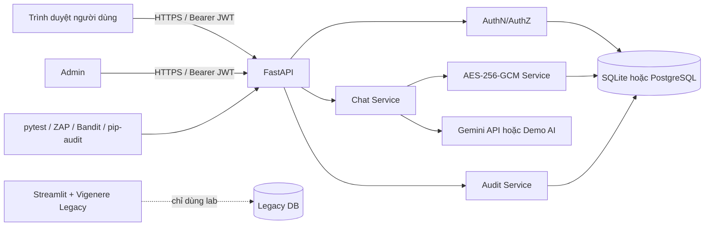

# Kiến trúc hệ thống

## Mục tiêu

Kiến trúc mới tách rõ danh tính, phân quyền, lưu trữ mã hóa, AI integration và audit. Luồng Streamlit/Vigenère cũ chỉ còn là đối tượng so sánh trong phòng lab.

## Ranh giới tin cậy

1. Internet/trình duyệt → API: mọi input đều không tin cậy.
2. API → database: chỉ truy cập qua SQLAlchemy, không ghép chuỗi SQL từ input.
3. Chat service → AI provider: không gửi API key xuống client; prompt người dùng không được xem là system instruction.
4. Crypto service → database: database chỉ nhận ciphertext, nonce, key version; khóa không lưu cùng dữ liệu.
5. User → resource: mọi thao tác session/message đều kiểm tra owner hoặc vai trò admin.

## Luồng gửi tin

1. API xác minh JWT và tải người dùng hiện hành.
2. Kiểm tra `session_id` thuộc người dùng; trả 404 khi không thuộc để giảm enumeration.
3. Validate nội dung tối đa 4.000 ký tự và loại ký tự điều khiển nguy hiểm.
4. Rate limit theo user.
5. AES-GCM mã hóa message user với AAD `session_id|role|key_version`.
6. Lấy và giải mã lịch sử đúng phiên trong service layer.
7. Gọi Gemini hoặc Demo AI.
8. Mã hóa phản hồi assistant và ghi audit metadata, không ghi plaintext chat vào audit.

## Mô hình dữ liệu

- `users`: username, Argon2 hash, role, active flag.
- `chat_sessions`: owner, title, timestamps.
- `secure_messages`: role, ciphertext, nonce, key version.
- `audit_events`: actor, event, target, outcome, IP, user agent, request ID, metadata an toàn.

## Quyết định kiến trúc

- Bearer token được giữ trong memory của trang demo, không lưu `localStorage`.
- Không dùng cookie xác thực nên không phát sinh CSRF cookie-session trong giao diện demo.
- AES-GCM cung cấp cả bí mật và kiểm tra toàn vẹn; thay đổi ciphertext/AAD/nonce làm giải mã thất bại.
- SQLite hỗ trợ chạy nhanh; SQLAlchemy cho phép đổi sang PostgreSQL qua `DATABASE_URL`.
